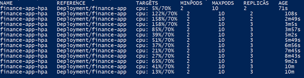
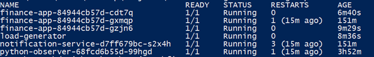

# Kubernetes: развёртывание Finance Manager

Оркестрация трёх прикладных сервисов проекта через Kubernetes (manifests в `k8s/`), с демонстрацией горизонтального автомасштабирования (HPA).

## Архитектура

- **finance-app** - основной backend (Spring Boot, Kafka producer, PostgreSQL), 2 реплики по умолчанию.
- **notification-service** - обработка событий из Kafka, своя PostgreSQL база.
- **python-observer** - health-мониторинг остальных сервисов, Prometheus-метрики.

Kafka, PostgreSQL (обе базы) и Redis остаются вне кластера и работают через существующий `docker-compose.yml` - разворачивать их внутри K8s (StatefulSet, PersistentVolume, KRaft-конфигурация Kafka) избыточно для целей практической демонстрации оркестрации и не даёт дополнительной ценности при таком масштабе проекта. Сервисы внутри кластера обращаются к внешней инфраструктуре через `host.minikube.internal`.

Взаимодействие между сервисами внутри кластера (finance-app → notification-service, python-observer → оба) идёт через K8s Service DNS, а не через прямые IP.

## Компоненты манифестов (`k8s/`)

| Файл | Назначение |
|---|---|
| `namespace.yaml` | изолированный namespace `finance-manager` |
| `secret.yaml` | креды PostgreSQL для обеих баз |
| `configmap.yaml` | адреса внешних Kafka/PostgreSQL/Redis |
| `finance-app.yaml` | Deployment + Service, 2 реплики, liveness/readiness/startup-пробы |
| `notification-service.yaml` | Deployment + Service, 1 реплика, те же пробы |
| `python-observer.yaml` | Deployment + Service |
| `hpa.yaml` | HorizontalPodAutoscaler для finance-app (2-10 реплик, целевой CPU 70%) |
| `ingress.yaml` | внешний доступ через nginx ingress-контроллер |

## Как поднять локально (minikube)

```bash
# 1. внешняя инфра
docker-compose up -d postgres notification-db redis kafka

# 2. кластер
minikube start --driver=docker
minikube addons enable metrics-server
minikube addons enable ingress

# 3. манифесты
kubectl apply -f k8s/namespace.yaml
kubectl apply -f k8s/secret.yaml
kubectl apply -f k8s/configmap.yaml
kubectl apply -f k8s/finance-app.yaml
kubectl apply -f k8s/notification-service.yaml
kubectl apply -f k8s/python-observer.yaml
kubectl apply -f k8s/hpa.yaml

# 4. проверка
kubectl get pods -n finance-manager
kubectl get hpa -n finance-manager
```

## Реальные проблемы при развёртывании (и как решались)

Список честный - это не книжный сетап, а живая отладка на конкретном железе:

- **Локальные образы не в registry.** Образы (`korteng/...`) собраны через `docker-compose build`, не запушены в Docker Hub. Решение - `minikube image load` + обязательный `imagePullPolicy: IfNotPresent` (по умолчанию для тега `:latest` Kubernetes игнорирует локальный кеш и пытается перекачать образ из registry).
- **Креды PostgreSQL из `.env` не совпадали с реальными живыми значениями в контейнере.** `POSTGRES_DB`/`POSTGRES_USER`/`POSTGRES_PASSWORD` в официальном Postgres-образе применяются только при первой инициализации пустого volume - если `.env` менялся после первого запуска контейнера, конфиги расходятся с реальностью. Диагностировано через прямое подключение `psql` в обход приложения.
- **Конфликт портов на хосте.** На порту 5432 одновременно слушали докеровский `finance-postgres` и нативная Windows-служба `postgres.exe` (от другого проекта) - соединения через `host.minikube.internal` рандомно попадали то в один, то в другой процесс. Диагностировано через `netstat -ano` + `tasklist`, решено переносом хостового порта docker-compose на 15432.
- **Медленный старт JVM под урезанными CPU/memory-лимитами** (90-160 секунд) не укладывался в стандартный `initialDelaySeconds` liveness-пробы - Kubernetes убивал контейнер посреди старта. Заменено на `startupProbe` с увеличенным `failureThreshold`, который не мешает штатным liveness/readiness после старта.
- **Ресурсные ограничения хоста** (2 физических ядра) под одновременную нагрузку от control-plane кластера + нескольких JVM. Демонстрация HPA под нагрузкой подтвердила, что архитектура и конфигурация рабочие, при этом постоянная работа с 2+ репликами на этом железе непрактична - в проде это решается нормальным provisioning, не конфигурацией.

## Демонстрация HPA под нагрузкой

Нагрузочный тест (`busybox`-под в цикле бьёт `/actuator/health`) поднял CPU до 158% от лимита на 2 репликах - HPA увеличил их число до 3. Трафик через Service `finance-app` автоматически распределился по новым репликам, и средняя загрузка CPU на под упала до 13-65% при той же интенсивности запросов:



Состояние подов во время теста - 3 реплики finance-app, load-generator, notification-service и python-observer:



## Архитектурные решения и дальнейшее развитие

- PostgreSQL сознательно оставлен вне кластера - на масштабе одного проекта StatefulSet/PersistentVolume для БД добавляют сложность без реальной выгоды, внешняя БД проще в поддержке, бэкапе и восстановлении.
- Манифесты - plain YAML, без Helm. На один сервис и одно окружение Helm избыточен; переход на Helm chart имеет смысл при появлении нескольких окружений (dev/staging/prod) с разными параметрами - решение сознательно отложено до момента, когда оно реально понадобится.
- Ingress и HPA настроены, проверены и задокументированы (демонстрация ниже). Для постоянного прогона с 2+ репликами в dev-кластере на этой машине не хватает ресурсов (2 физических ядра) - ограничение чисто по железу, конфигурация к продакшну готова как есть.
