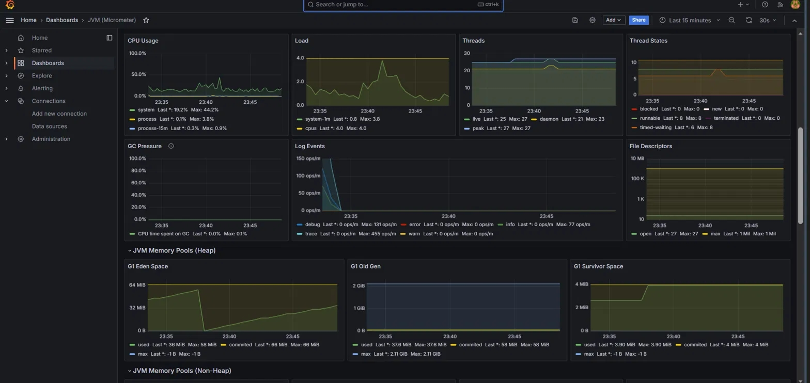
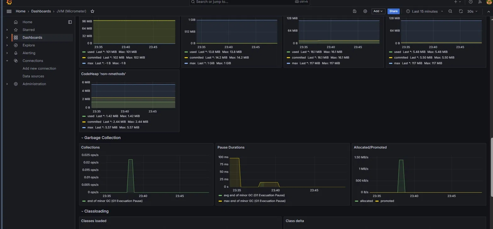

# Finance Manager

Персональное приложение для учёта финансов с событийно-ориентированной микросервисной архитектурой: создание транзакции публикует событие в Kafka, которое асинхронно обрабатывает отдельный сервис уведомлений.

## Архитектура

```
                    ┌───────────────────────┐
                    │   finance-manager-app │
                    │   (REST API, JWT)     │
                    └──────────┬────────────┘
                               │
                    ┌──────────┴─────────────┐
                    │                        │
              ┌─────▼──────┐          ┌──────▼───────┐
              │ finance_db │          │    Kafka     │
              │ (Postgres) │          │ transaction- │
              └────────────┘          │    events    │
                                      └──────┬───────┘
                                             │
                                  ┌──────────▼────────────┐
                                  │  notification-service │
                                  │  (Kafka consumer)     │
                                  └──────────┬────────────┘
                                             │
                                  ┌──────────▼──────────┐
                                  │  notification_db    │
                                  │  (Postgres)         │
                                  └─────────────────────┘

        Prometheus ──scrape──> оба сервиса (/actuator/prometheus)
        Grafana ──query──> Prometheus (дашборды JVM/HTTP/Kafka)
```

**Принцип разделения:** `finance-manager-app` отвечает за бизнес-логику транзакций и не знает, кто и как обрабатывает события — публикует их в Kafka и продолжает работу. `notification-service` независимо читает поток событий, ведёт собственный лог уведомлений в отдельной БД и может быть остановлен/обновлён без влияния на основной сервис.

## Стек технологий

- **Java 17**, Spring Boot 3.5.16
- **Spring Security + JWT** — аутентификация без сессий (stateless)
- **Spring Data JPA + PostgreSQL** — отдельная БД на каждый сервис
- **Flyway** — версионирование схемы БД
- **Apache Kafka** (KRaft mode, без Zookeeper) — асинхронный обмен событиями между сервисами
- **Docker Compose** — оркестрация всех сервисов для локальной разработки
- **Prometheus + Grafana** — мониторинг JVM-метрик, HTTP-запросов, GC, Kafka producer/consumer
- **JUnit 5, Mockito, Testcontainers** — тестирование с реальным Postgres в интеграционных тестах
- **GitHub Actions + CodeQL** — CI и статический анализ безопасности

## Быстрый старт

```bash
git clone https://github.com/Korteng/finance-manager.git
cd finance-manager
cp .env.example .env
# отредактируй .env — задай реальные пароли для БД
docker compose up --build
```

После запуска доступны:

| Сервис | URL |
|---|---|
| finance-manager-app | http://localhost:8080 |
| notification-service | http://localhost:8081 |
| Prometheus | http://localhost:9090 |
| Grafana | http://localhost:3000 (admin/admin) |
| Kafka | localhost:9092 |

## API

### Аутентификация (finance-manager-app)

```
POST /api/auth/register   { "username": "...", "password": "..." }  → { "token": "..." }
POST /api/auth/login      { "username": "...", "password": "..." }  → { "token": "..." }
```

### Транзакции (finance-manager-app, требует JWT в заголовке `Authorization: Bearer <token>`)

```
POST /api/transactions   { "amount": 500.00, "currency": "RUB", "categoryId": 1, "description": "..." }
GET  /api/transactions/{id}
```

При успешном создании транзакции в Kafka-топик `transaction-events` публикуется событие `TRANSACTION_CREATED`.

### Уведомления (notification-service)

```
GET /api/notifications?userId={id}&page=0&size=20
```

Возвращает лог событий, обработанных сервисом уведомлений для указанного пользователя.

### Мониторинг (оба сервиса)

```
GET /actuator/health              — статус приложения
GET /actuator/health/liveness     — liveness probe
GET /actuator/health/readiness    — readiness probe
GET /actuator/prometheus          — метрики в формате Prometheus
GET /actuator/info                — версия и метаданные приложения
```

## Тестирование

```bash
cd finance-manager-app
./mvnw test
```

Интеграционные тесты (`contextLoads`) поднимают реальный Postgres через Testcontainers — требуется запущенный Docker.

## Мониторинг: скриншоты

Дашборд Grafana (JVM Micrometer) под нагрузкой — 50 транзакций подряд, виден отклик CPU/GC/Threads/Heap:





## Структура репозитория

```
finance-manager/
├── finance-manager-app/     — основной REST API, JWT-авторизация, Kafka producer
├── notification-service/    — Kafka consumer, независимая БД
├── prometheus/
│   └── prometheus.yml       — конфигурация scrape для обоих сервисов
├── docker-compose.yml        — оркестрация: 2×Postgres, Kafka, оба сервиса, Prometheus, Grafana
└── .env.example              — шаблон переменных окружения
```

## Roadmap

- [ ] Реальная доставка уведомлений (email/webhook) вместо только записи в БД
- [ ] Отдельный Grafana-дашборд под Kafka producer/consumer lag
- [ ] Тестовое покрытие notification-service
- [ ] Provisioning Grafana-дашбордов через конфиг (без ручного импорта)
