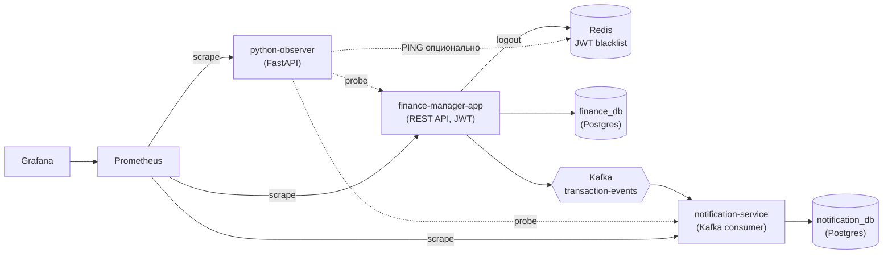
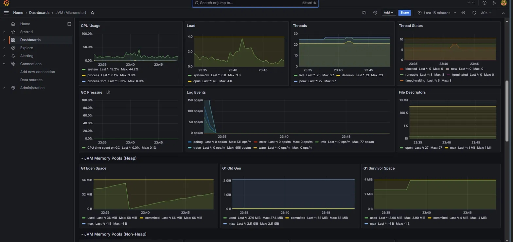
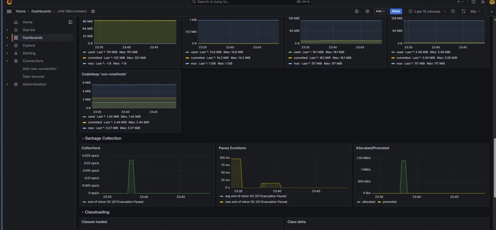

# Finance Manager

Персональное приложение для учёта финансов с событийно-ориентированной микросервисной архитектурой: создание транзакции публикует событие в Kafka, которое асинхронно обрабатывает отдельный сервис уведомлений.

## Архитектура


```mermaid
flowchart LR
    GRAF["Grafana"] --> PROM["Prometheus"]
    PROM -- "scrape" --> OBS["python-observer<br/>(FastAPI)"]
    PROM -- "scrape" --> APP["finance-manager-app<br/>(REST API, JWT)"]
    PROM -- "scrape" --> NOTIF["notification-service<br/>(Kafka consumer)"]

    OBS -. "probe" .-> APP
    OBS -. "probe" .-> NOTIF
    OBS -. "PING опционально" .-> REDIS[("Redis<br/>JWT blacklist")]

    APP --> DB1[("finance_db<br/>(Postgres)")]
    APP -- "logout" --> REDIS
    APP --> KAFKA{{"Kafka<br/>transaction-events"}}
    KAFKA --> NOTIF
    NOTIF --> DB2[("notification_db<br/>(Postgres)")]
```

**Принцип разделения:** `finance-manager-app` отвечает за бизнес-логику транзакций и не знает, кто и как обрабатывает события - публикует их в Kafka и продолжает работу. `notification-service` независимо читает поток событий, ведёт собственный лог уведомлений в отдельной БД и может быть остановлен/обновлён без влияния на основной сервис. `python-observer` не входит в путь запроса ни одного из сервисов - это внешний наблюдатель, который опрашивает их снаружи и может быть остановлен без какого-либо влияния на работу приложения.

## Стек технологий

- **Java 17**, Spring Boot 3.5.16
- **Spring Security + JWT** — аутентификация без сессий (stateless)
- **Spring Data JPA + PostgreSQL** — отдельная БД на каждый сервис
- **Flyway** — версионирование схемы БД
- **Apache Kafka** (KRaft mode, без Zookeeper) — асинхронный обмен событиями между сервисами
- **Redis** — blacklist для отозванных JWT-токенов (logout)
- **Docker Compose** — оркестрация всех сервисов для локальной разработки
- **Prometheus + Grafana** — мониторинг JVM-метрик, HTTP-запросов, GC, Kafka producer/consumer
- **JUnit 5, Mockito, Testcontainers** — тестирование с реальным Postgres в интеграционных тестах
- **GitHub Actions + CodeQL** — CI и статический анализ безопасности

## Быстрый старт

```bash
git clone https://github.com/Korteng/finance-manager.git
cd finance-manager
cp .env.example .env
# отредактируй .env — задай реальные пароли для БД
docker compose up --build
```

После запуска доступны:

| Сервис | URL |
|---|---|
| finance-manager-app | http://localhost:8080 |
| notification-service | http://localhost:8081 |
| Prometheus | http://localhost:9090 |
| Grafana | http://localhost:3000 (admin/admin) |
| Kafka | localhost:9092 |
| python-observer | http://localhost:9100/metrics |

## API

### Аутентификация (finance-manager-app)

```
POST /api/auth/register   { "username": "...", "password": "..." }  → { "token": "..." }
POST /api/auth/login      { "username": "...", "password": "..." }  → { "token": "..." }
POST /api/auth/logout     Authorization: Bearer <token>  → 200 OK
```

Токен `logout` кладётся в Redis-blacklist с TTL, равным оставшемуся сроку его действия — дальше `JwtAuthFilter` отклоняет его при каждом запросе, даже если подпись валидна и срок жизни токена не истёк.

### Транзакции (finance-manager-app, требует JWT в заголовке `Authorization: Bearer <token>`)

```
POST /api/transactions   { "amount": 500.00, "currency": "RUB", "categoryId": 1, "description": "..." }
GET  /api/transactions/{id}
```

При успешном создании транзакции в Kafka-топик `transaction-events` публикуется событие `TRANSACTION_CREATED`.

### Уведомления (notification-service)

```
GET /api/notifications?userId={id}&page=0&size=20
```

Возвращает лог событий, обработанных сервисом уведомлений для указанного пользователя.

### Мониторинг (оба сервиса)

```
GET /actuator/health              — статус приложения
GET /actuator/health/liveness     — liveness probe
GET /actuator/health/readiness    — readiness probe
GET /actuator/prometheus          — метрики в формате Prometheus
GET /actuator/info                — версия и метаданные приложения
```

## python-observer — SRE-sidecar

Отдельный Python-сервис (FastAPI + `prometheus_client`), который активно опрашивает `finance-manager-app` и `notification-service` — не изнутри JVM, а снаружи, как это делал бы `blackbox_exporter`. На каждый таргет два независимых чек:

- **TCP connect (L4)** — открыт ли порт вообще, изолированно от логики приложения
- **HTTP health-check (L7)** — отвечает ли `/actuator/health`, с полным замером round-trip

Опционально проверяет и сам Redis настоящим `PING` (не просто TCP-коннект) — `finance-manager-app` зависит от него для JWT-blacklist, так что это закрывает цепочку мониторинга целиком.

Метрики — `Histogram`, не усреднённые/перцентильные значения из Python: p50/p95/p99 считаются в момент запроса через PromQL, как это принято в проде:

```promql
histogram_quantile(0.99, sum(rate(probe_duration_seconds_bucket[5m])) by (le, target))
```

Уже вписан в корневой `docker-compose.yml` и в scrape-конфиг Prometheus. Метрики: `http://localhost:9100/metrics`. Liveness: `http://localhost:9100/health`.

Подробности и локальный запуск без compose — в [`python-observer/README.md`](python-observer/README.md).

## Тестирование

```bash
cd finance-manager-app
./mvnw test
```

Интеграционные тесты (`contextLoads`) поднимают реальный Postgres через Testcontainers — требуется запущенный Docker.

## Мониторинг: скриншоты

Дашборд Grafana (JVM Micrometer) под нагрузкой — 50 транзакций подряд, виден отклик CPU/GC/Threads/Heap:





## Структура репозитория

```
finance-manager/
├── finance-manager-app/      — основной REST API, JWT-авторизация, Kafka producer
├── notification-service/     — Kafka consumer, независимая БД
├── python-observer/          — Python/FastAPI-сайдкар: TCP+HTTP пробы обоих сервисов, опционально Redis PING
├── prometheus/
│   └── prometheus.yml        — конфигурация scrape для finance-manager-app, notification-service, python-observer
├── docker-compose.yml        — оркестрация: 2×Postgres, Redis, Kafka, оба сервиса, python-observer, Prometheus, Grafana
└── .env.example               — шаблон переменных окружения
```

## Roadmap

- [ ] Реальная доставка уведомлений (email/webhook) вместо только записи в БД
- [ ] Отдельный Grafana-дашборд под Kafka producer/consumer lag
- [ ] Тестовое покрытие notification-service
- [ ] Provisioning Grafana-дашбордов через конфиг (без ручного импорта)