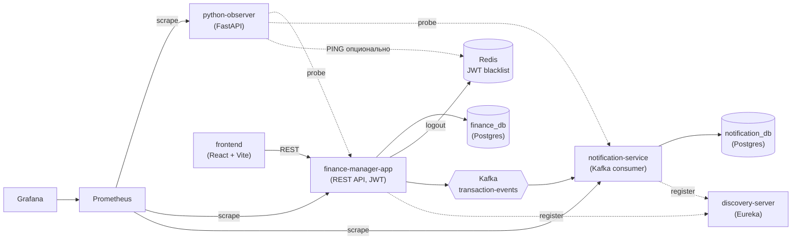
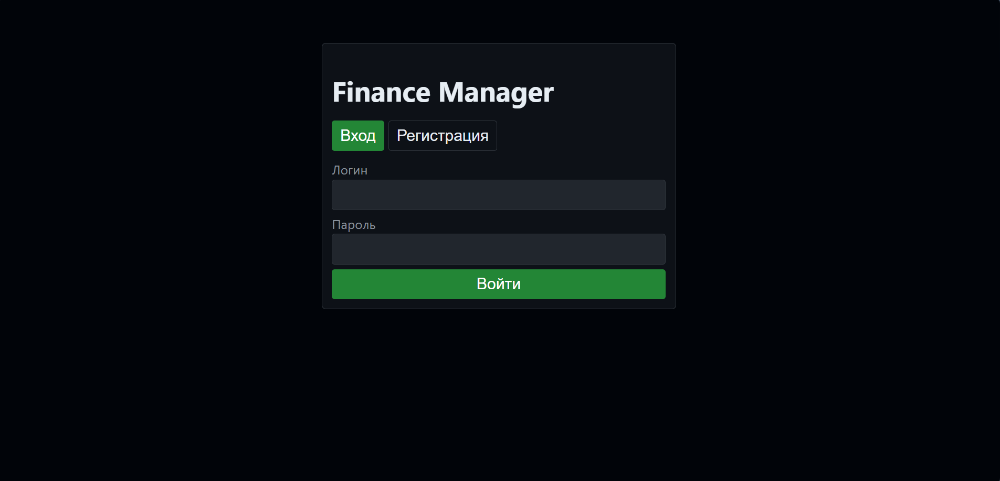
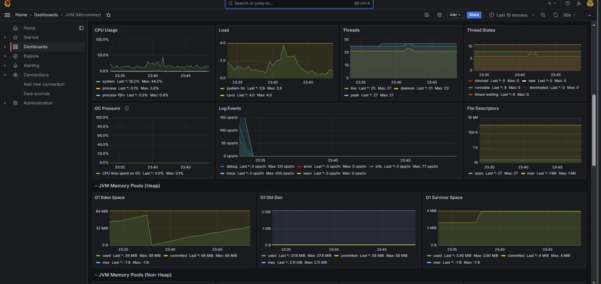
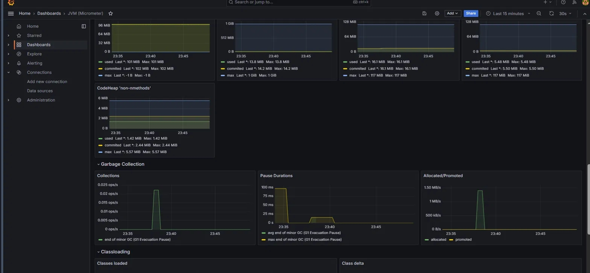
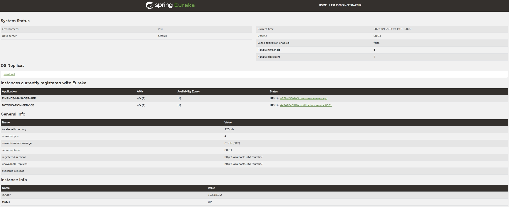

# Finance Manager

Персональное приложение для учёта финансов с событийно-ориентированной микросервисной архитектурой: создание транзакции публикует событие в Kafka, которое асинхронно обрабатывает отдельный сервис уведомлений. Backend на Spring Boot, фронтенд на React.

## Архитектура


```mermaid
flowchart LR
    GRAF["Grafana"] --> PROM["Prometheus"]
    PROM -- "scrape" --> OBS["python-observer<br/>(FastAPI)"]
    PROM -- "scrape" --> APP["finance-manager-app<br/>(REST API, JWT)"]
    PROM -- "scrape" --> NOTIF["notification-service<br/>(Kafka consumer)"]

    FE["frontend<br/>(React + Vite)"] -- "REST" --> APP

    OBS -. "probe" .-> APP
    OBS -. "probe" .-> NOTIF
    OBS -. "PING опционально" .-> REDIS[("Redis<br/>JWT blacklist")]

    APP --> DB1[("finance_db<br/>(Postgres)")]
    APP -- "logout" --> REDIS
    APP --> KAFKA{{"Kafka<br/>transaction-events"}}
    KAFKA --> NOTIF
    NOTIF --> DB2[("notification_db<br/>(Postgres)")]

    APP -. "register" .-> DISC["discovery-server<br/>(Eureka)"]
    NOTIF -. "register" .-> DISC
```

**Принцип разделения:** `finance-manager-app` отвечает за бизнес-логику транзакций и не знает, кто и как обрабатывает события - публикует их в Kafka и продолжает работу. `notification-service` независимо читает поток событий, ведёт собственный лог уведомлений в отдельной БД и может быть остановлен/обновлён без влияния на основной сервис. `python-observer` не входит в путь запроса ни одного из сервисов - это внешний наблюдатель, который опрашивает их снаружи и может быть остановлен без какого-либо влияния на работу приложения. `frontend` - обычный клиент REST API, не участвует в событийном обмене. Оба прикладных сервиса регистрируются в `discovery-server` (Eureka) - пока не используется для клиентского балансирования нагрузки, но уже даёт единый реестр живых инстансов, к которому можно подключить Feign/Ribbon или API Gateway без правки адресов вручную.

## Стек технологий

**Backend**
- **Java 17**, Spring Boot 3.5.16
- **Spring Security + JWT** - аутентификация без сессий (stateless), секрет подписи берётся из переменной окружения `APP_JWT_SECRET`, а не хранится в коде
- **Spring Data JPA + PostgreSQL** - отдельная БД на каждый сервис, сущности и DTO разнесены по разным пакетам, наружу через API отдаются только DTO
- **Flyway** - версионирование схемы БД
- **Apache Kafka** (KRaft mode, без Zookeeper) - асинхронный обмен событиями между сервисами
- **Redis** - blacklist для отозванных JWT-токенов (logout)
- **Docker Compose** - оркестрация всех сервисов для локальной разработки
- **Kubernetes** - манифесты Deployment/Service/ConfigMap/Secret/HPA/Ingress для оркестрации в кластере, подробности в [`K8S.md`](K8S.md)
- **Spring Cloud Netflix Eureka** - service discovery, `finance-manager-app` и `notification-service` регистрируются как клиенты в `discovery-server`, дашборд доступен на `:8761`
- **gRPC** - один unary-эндпоинт (`GetTransaction`) поверх той же бизнес-логики, что и REST `GET /api/transactions/{id}` - proto-контракт в [`finance-manager-app/src/main/proto/transaction.proto`](finance-manager-app/src/main/proto/transaction.proto)
- **Prometheus + Grafana** - мониторинг JVM-метрик, HTTP-запросов, GC, Kafka producer/consumer
- **JUnit 5, Mockito, Testcontainers** - юнит-тесты на сервисном слое (включая проверку бюджетной логики через моки Kafka) и интеграционные тесты с реальным Postgres
- **GitHub Actions + CodeQL** - CI и статический анализ безопасности

**Frontend**
- **React 19 + Vite** - тёмная тема, две вкладки (Транзакции, Бюджеты)
- Токен JWT живёт только в памяти вкладки, без localStorage - разлогин при обновлении страницы, для пет-проекта это осознанный компромисс в пользу простоты

## Быстрый старт

Backend и инфраструктура:

```bash
git clone https://github.com/Korteng/finance-manager.git
cd finance-manager
cp .env.example .env
# отредактируй .env - задай реальные пароли для БД и свой APP_JWT_SECRET
docker compose up --build
```

После запуска доступны:

| Сервис | URL |
|---|---|
| finance-manager-app | http://localhost:8080 |
| notification-service | http://localhost:8081 |
| discovery-server (Eureka) | http://localhost:8761 |
| Prometheus | http://localhost:9090 |
| Grafana | http://localhost:3000 (admin/admin) |
| Kafka | localhost:9092 |
| python-observer | http://localhost:9100/metrics |

Frontend (отдельно, в соседней консоли):

```bash
cd frontend
npm install
npm run dev
```

По умолчанию фронтенд ходит на `http://localhost:8080`, переопределяется переменной `VITE_API_BASE_URL`. Приложение доступно на `http://localhost:5173`.

## API

### Аутентификация (finance-manager-app)

```
POST /api/auth/register   { "username": "...", "password": "..." }  → { "token": "..." }
POST /api/auth/login      { "username": "...", "password": "..." }  → { "token": "..." }
POST /api/auth/logout     Authorization: Bearer <token>  → 200 OK
```

Токен `logout` кладётся в Redis-blacklist с TTL, равным оставшемуся сроку его действия - дальше `JwtAuthFilter` отклоняет его при каждом запросе, даже если подпись валидна и срок жизни токена не истёк.

### Категории (finance-manager-app, требует JWT)

```
GET /api/categories
GET /api/categories/{id}
```

### Транзакции (finance-manager-app, требует JWT в заголовке `Authorization: Bearer <token>`)

```
POST /api/transactions   { "amount": 500.00, "currency": "RUB", "categoryId": 1, "description": "..." }
GET  /api/transactions/{id}
GET  /api/transactions?categoryId=&from=&to=
```

При успешном создании транзакции в Kafka-топик `transaction-events` публикуется событие `TRANSACTION_CREATED`. Если для категории и текущего периода задан бюджет и сумма трат по нему превышена, дополнительно публикуется `BUDGET_EXCEEDED`.

### Бюджеты (finance-manager-app, требует JWT)

```
POST /api/budgets   { "categoryId": 1, "period": "2026-09", "limitAmount": 20000.00 }
GET  /api/budgets?period=2026-09
```

`GET` без параметра `period` возвращает бюджеты за текущий месяц, для каждого - лимит, фактические траты по категории за период и флаг `exceeded`.

### gRPC (finance-manager-app, порт 9091)

Тот же `GET /api/transactions/{id}` доступен и как unary gRPC-вызов - оба маршрута (REST и gRPC) вызывают один и тот же `TransactionService`, так что проверка владельца транзакции работает одинаково в обоих случаях. Контракт - [`transaction.proto`](finance-manager-app/src/main/proto/transaction.proto).

```
service TransactionGrpcService {
  rpc GetTransaction (GetTransactionRequest) returns (TransactionGrpcResponse);
}
```

Проверка через [grpcurl](https://github.com/fullstorydev/grpcurl) (сервис пока без reflection, схему передаём явно):

```bash
grpcurl -plaintext -import-path finance-manager-app/src/main/proto -proto transaction.proto \
  -d '{"id": 1, "user_id": 1}' \
  localhost:9091 ru.korteng.financemanager.grpc.TransactionGrpcService/GetTransaction
```

### Уведомления (notification-service)

```
GET /api/notifications?userId={id}&page=0&size=20
```

Возвращает лог событий, обработанных сервисом уведомлений для указанного пользователя.

### Мониторинг (оба сервиса)

```
GET /actuator/health              - статус приложения
GET /actuator/health/liveness     - liveness probe
GET /actuator/health/readiness    - readiness probe
GET /actuator/prometheus          - метрики в формате Prometheus
GET /actuator/info                - версия и метаданные приложения
```

## python-observer - SRE-sidecar

Отдельный Python-сервис (FastAPI + `prometheus_client`), который активно опрашивает `finance-manager-app` и `notification-service` - не изнутри JVM, а снаружи, как это делал бы `blackbox_exporter`. На каждый таргет два независимых чек:

- **TCP connect (L4)** - открыт ли порт вообще, изолированно от логики приложения
- **HTTP health-check (L7)** - отвечает ли `/actuator/health`, с полным замером round-trip

Опционально проверяет и сам Redis настоящим `PING` (не просто TCP-коннект) - `finance-manager-app` зависит от него для JWT-blacklist, так что это закрывает цепочку мониторинга целиком.

Метрики - `Histogram`, не усреднённые/перцентильные значения из Python: p50/p95/p99 считаются в момент запроса через PromQL, как это принято в проде:

```promql
histogram_quantile(0.99, sum(rate(probe_duration_seconds_bucket[5m])) by (le, target))
```

Уже вписан в корневой `docker-compose.yml` и в scrape-конфиг Prometheus. Метрики: `http://localhost:9100/metrics`. Liveness: `http://localhost:9100/health`.

Подробности и локальный запуск без compose - в [`python-observer/README.md`](python-observer/README.md).

## Тестирование

```bash
cd finance-manager-app
./mvnw test
```

Юнит-тесты сервисного слоя (Mockito, без поднятия контекста) и интеграционные тесты (`contextLoads`), поднимающие реальный Postgres через Testcontainers - требуется запущенный Docker.

## Frontend: скриншот



## Мониторинг: скриншоты

Дашборд Grafana (JVM Micrometer) под нагрузкой - 50 транзакций подряд, виден отклик CPU/GC/Threads/Heap:





Дашборд Eureka (`discovery-server`) - оба прикладных сервиса зарегистрированы и в статусе UP:



## Kubernetes

Три прикладных сервиса (finance-manager-app, notification-service, python-observer) деплоятся в кластер через Deployment + Service, внешняя инфраструктура (Kafka/Postgres/Redis) остаётся в Docker Compose. Настроено горизонтальное автомасштабирование (HPA) с демонстрацией под реальной нагрузкой, а также разбор проблем, с которыми столкнулись при развёртывании (конфликт портов, медленный старт JVM под пробами, локальные образы без registry).

Подробности, манифесты и скриншоты - в [`K8S.md`](K8S.md).

## Структура репозитория

```
finance-manager/
├── finance-manager-app/      - основной REST API, JWT-авторизация, Kafka producer
├── notification-service/     - Kafka consumer, независимая БД
├── discovery-server/         - Eureka-сервер service discovery, регистрация обоих прикладных сервисов
├── frontend/                  - React + Vite клиент REST API
├── python-observer/          - Python/FastAPI-сайдкар: TCP+HTTP пробы обоих сервисов, опционально Redis PING
├── prometheus/
│   └── prometheus.yml        - конфигурация scrape для finance-manager-app, notification-service, python-observer
├── k8s/                       - манифесты Kubernetes (Deployment/Service/ConfigMap/Secret/HPA/Ingress)
├── K8S.md                     - гайд по развёртыванию в Kubernetes и демонстрация HPA
├── docker-compose.yml        - оркестрация: 2×Postgres, Redis, Kafka, оба сервиса, python-observer, Prometheus, Grafana
└── .env.example               - шаблон переменных окружения
```

## Roadmap

- [ ] Реальная доставка уведомлений (email/webhook) вместо только записи в БД
- [ ] Отдельный Grafana-дашборд под Kafka producer/consumer lag
- [ ] Provisioning Grafana-дашбордов через конфиг (без ручного импорта)
